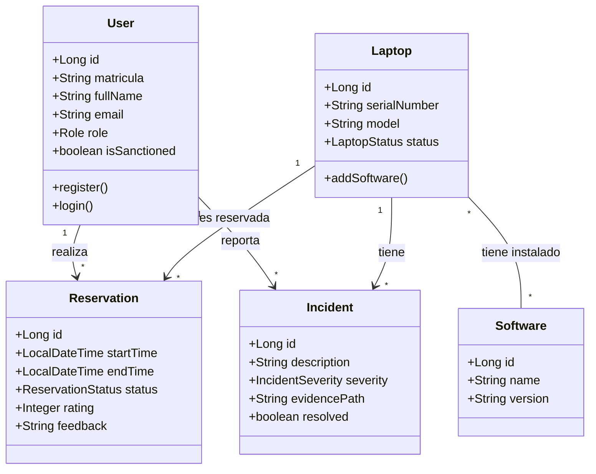
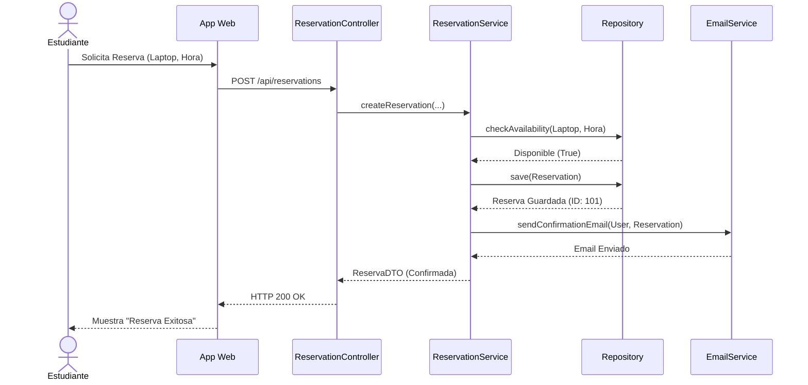
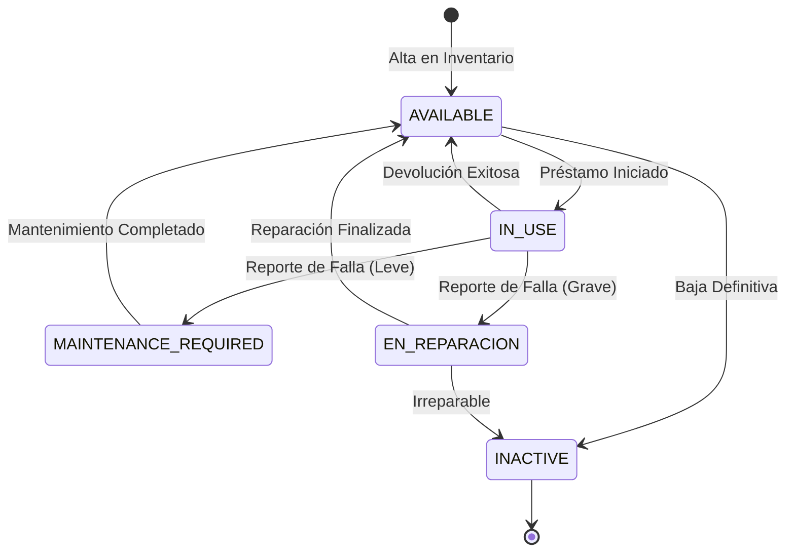

# Otros Diagramas UML Recomendados - LabManager

Para un trabajo académico completo, además de los Casos de Uso, es fundamental incluir diagramas que muestren la estructura estática, el comportamiento dinámico y los estados de las entidades críticas.

A continuación, se presentan los 3 diagramas más relevantes para tu sistema: **Clases**, **Secuencia** y **Estados**.

## 1. Diagrama de Clases (Estructura Estática)

Muestra las entidades, sus atributos principales y cómo se relacionan entre sí.

---

## 2. Diagrama de Secuencia (Flujo de Reserva)

Este diagrama es vital porque muestra la interacción temporal entre el Estudiante, el Sistema (API) y la Base de Datos para el proceso más importante: **Hacer una Reserva**.

---

## 3. Diagrama de Estados (Ciclo de Vida de una Laptop)

Explica cómo cambia el estado de un equipo, lo cual es clave para la lógica de negocio del inventario.

## Resumen de Utilidad

1.  **Diagrama de Clases:** Sirve para explicar tu base de datos y modelo de objetos en la sección de "Diseño del Sistema".
2.  **Diagrama de Secuencia:** Sirve para detallar la lógica del backend en la sección de "Funcionamiento".
3.  **Diagrama de Estados:** Sirve para justificar las reglas de negocio sobre cuándo se puede prestar un equipo y cuándo no.
